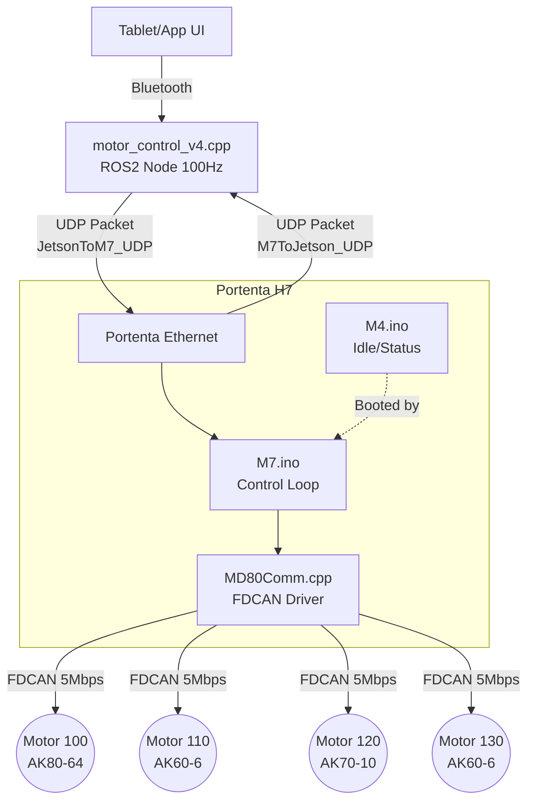

# 상지 재활 로봇 제어 시스템 갱신 문서 (Control System Renewal)

이 문서는 Jetson(상위 제어기)과 Portenta H7(하위 제어기) 간의 UDP 기반 다중 모터 제어 아키텍처, 사용된 코드의 역할, 알고리즘 흐름, 그리고 통신 지연(RTT)에 대한 종합적인 분석을 담고 있습니다.

---

## 1. 시스템 아키텍처 개요 (Architecture Overview)

새롭게 개편된 시스템은 **ROS 2 (Jetson) ↔ 이더넷 UDP ↔ Portenta H7 (M7 코어) ↔ FDCAN ↔ MAB Robotics MD80 모터 4개** 로 이어지는 실시간 제어 구조를 가집니다.

### 1.1. 구조 비교 요약 (Architecture Comparison)

| 구분 | 기존 구조 (Jetson 중심 중앙 집중) | 수정 구조 (상위-하위 역할 분담) |
| :---: | :--- | :--- |
| **통신 흐름** | 태블릿 ↔ Jetson ↔ Portenta H7 ↔ 모터 | 태블릿 ↔ (BT) ↔ Jetson ↔ (UDP) ↔ Portenta H7 ↔ (FDCAN) ↔ 4 Motors |
| **상위 제어 (Jetson)** | 블루투스 통신 수신, 토크 직접 연산, UDP 송신 | 블루투스 통신 수신, 구동 관절 및 모드(AROM, PROM 등) 판단 후 제어 상태(명령)만 UDP 송신 |
| **하위 제어 (Portenta H7)** | 단순 통신 브릿지 (UDP 데이터를 모터로 단순 바이패스) | **[M7 코어]** 상위 명령 수신, 4개 모터의 독립적 토크 연산(DOB 등) 및 FDCAN 통신 전담 (500Hz 제어 루프)<br>**[M4 코어]** 하드웨어 공유 메모리(SRAM4) 기반 지능형 모터 통신 단절 감시 및 E-Stop 발동 (안전 감시자) |
| **제어 성능 및 안전성** | Jetson OS 통신 지연(네트워크 큐잉) 및 연산 병목으로 인한 제어 주기 불안정 위험 | 500Hz 실시간 제어 루프 독립 확보로 네트워크 지연 극복 및, 분리된 코어(M4)를 통한 완벽한 하드웨어 레벨 안전성 보장 |

### 1.2. 제어 흐름도 (Control Flow Diagram)


---

## 2. 모듈별 상세 분석

### 2.1. `motor_control_v4.cpp` (Jetson ROS 2 노드)
*   **역할**: 태블릿에서 수신한 문자열 명령(예: `PART:rShoulderEF` 후 `arom`)을 파싱하여, M7 코어가 즉시 제어할 수 있도록 **숫자형 바이너리 구조체(`JetsonToM7_UDP`)로 변환**합니다.
*   **주요 특징**:
    *   **FIX_POS 자동 할당**: 사용자가 선택한 관절(예: Motor 100)을 제외한 나머지 3개의 관절은 자동으로 `FIX_POS` 모드로 설정하여 0도(HOME_POS)에 안전하게 고정시킵니다.
    *   **비동기 멀티스레딩**: 송신 스레드(`controlTxLoop`)는 **100Hz(10ms 주기)로 무조건 패킷을 쏘아** M7에 명령을 지속적으로 전달하고, 수신 스레드(`udpReceiveLoop`)는 M7의 응답을 기다려 RTT를 계산합니다.
    *   **동기화**: `#pragma pack(push, 1)`을 사용하여 32비트(Portenta)와 64비트(Jetson) 시스템 간의 패딩으로 인한 구조체 크기 불일치(Size Mismatch)를 방지했습니다.

### 2.2. `M7.ino` (Portenta H7 메인 제어 루프)
*   **역할**: Jetson의 UDP 패킷을 수신하고, 4개의 모터에 대한 독립적인 상태(MotorState)를 관리하며, 매 루프마다 각 모터에 대한 제어 토크를 계산하여 모터로 전송합니다.
*   **주요 특징**:
    *   **독립적 제어 구조체 (`MotorState`)**: 4개의 모터가 서로 간섭하지 않도록 외란관측기(DOB), 궤적 버퍼(CPM Trap Traj) 변수들을 배열로 독립시켰습니다.
    *   **동적 메모리 할당**: SRAM의 BSS 영역(전역 변수 영역) 한계를 방지하기 위해 `setup()`에서 `new float[10000]`을 통해 CPM 궤적 버퍼(20초 분량)를 힙(Heap) 영역에 안전하게 할당했습니다.
    *   **이벤트 감지 출력**: 매 루프마다 로그를 출력하여 시리얼 통신을 지연시키지 않고, `prev_mode` 변수를 통해 **모드가 변경되는 그 순간(Event)에만 1회 출력**하도록 최적화되었습니다.

### 2.3. `MD80Comm.cpp` & `MD80Comm.h` (FDCAN 드라이버)
*   **역할**: MAB Robotics MD80 모터 드라이버와 **FDCAN (Nominal 1M / Data 5M, BRS ON)** 규격으로 통신하는 로우레벨 인터페이스입니다.
*   **주요 특징**:
    *   **STM32 HAL 직접 제어**: Arduino_CAN 라이브러리는 5Mbps 데이터 페이즈 및 BRS(Bit Rate Switch)를 완벽히 지원하지 못하므로, 과거 M4에서 성공했던 **STM32 HAL FDCAN 설정 코드를 완벽히 이식**했습니다.
    *   **프레임 타입 최적화**: CAN2.0 프레임(0x44) 대신 FDCAN 전용 레지스터 프레임(0x42, 0x41)을 사용하여 MD80과의 통신을 성공시켰습니다.
    *   **황금 딜레이 (150us)**: 연속적인 레지스터 읽기/쓰기 시 MD80 드라이버의 수신 버퍼 큐가 가득 차는 것을 방지하기 위해 프레임 간 `150us`의 필수 딜레이를 복구했습니다.

### 2.4. `M4.ino` (안전 감시자 / Safety Watchdog)
*   **역할**: 메인 제어기(M7)와 FDCAN 모터 간의 물리적 통신 상태를 백그라운드에서 감시하는 **안전 감시자** 역할을 수행합니다. M7과 하드웨어 공유 메모리(`SRAM4: 0x38001000`)를 통해 실시간으로 상태를 교환합니다.
*   **주요 특징**:
    *   **지능형 단절 감시**: Jetson에서 제어 시작 명령(Enable)이 떨어지는 순간, 물리적으로 연결되어 응답을 보내는 모터들만 "감시 대상"으로 동적 등록합니다. 이후 10Hz 주기로 공유 메모리를 확인하여, **감시 대상으로 등록되었던 모터 중 단 하나라도 응답이 끊기면(motor_comm_failed)** 치명적 오류로 판단합니다. (1개 연결 시 1개만 감시, 4개 연결 시 4개 모두 감시)
    *   **비상 정지 (E-Stop)**: FDCAN 선이 끊어지는 등의 물리적 단절 감지 시 `e_stop_triggered` 플래그를 올려 M7의 모터 출력을 즉각 0으로 만들고 제어를 영구 차단시킵니다. 동시에 Portenta 보드의 내장 LED를 초록색에서 빨간색으로 변경하여 시각적 경고를 줍니다.
    *   **통신 분리 최적화**: 기존 Jetson UDP 통신 연결 지연으로 인한 오작동(False Positive)을 제거하고, 순수하게 로봇 하드웨어의 치명적 결함(모터 통신 보드 사망, 케이블 단선 등) 시에만 개입하도록 최적화되었습니다.

---

## 3. 알고리즘 제어 흐름 (Control Flow)

1. **[명령 수신]** Jetson에서 100Hz로 `JetsonToM7_UDP` 패킷 전송 (로봇 켜짐, 모드 정보 등).
2. **[M7 UDP 수신]** `parsePacket()`을 통해 패킷을 읽어 `MotorState` 구조체의 목표 위치/모드를 갱신. (상태 변경 시 이벤트 로그 출력)
3. **[M7 제어 루프]** 4개의 모터에 대해 순차적으로 다음을 수행 (`for i=0~3`):
    *   `readMotorState(i)`: 모터 현재 Pos, Vel, Real Torque 읽기 (각 통신마다 150us 딜레이 소요).
    *   `run_*()`: 모드에 따른 제어기 (CPM 사다리꼴 궤적, AROM/PROM의 DOB 투명화 모드, FIX_POS PD 제어 등) 실행 ➡️ 목표 토크(`cmd_tau`) 도출.
    *   `clamp_torque()` & `setTargetTorque()`: 안전 게인을 적용한 후 모터로 명령 전송.
4. **[M7 상태 응답]** 4개 모터 처리가 끝난 직후 측정한 계산 소요 시간(`fdcan_rtt_total`)과 상태를 `M7ToJetson_UDP`에 담아 Jetson으로 즉각 반환.

---

## 4. 제어 주기 및 통신 지연시간(RTT) 분석

Jetson에서 출력된 다음과 같은 로그를 기반으로 분석합니다.
```text
[RIGHT] Latency | Total RTT: 92567 us | FDCAN RTT: 15323 us | M7 Process: 15338 us
      [0] Pos:  0.76 | Vel:  0.00 | TauCmd:  -1.04 | TauMeas:   0.00
      [1] Pos:  0.00 | Vel:  0.00 | TauCmd:   0.00 | TauMeas:   0.00
      [2] Pos:  0.00 | Vel:  0.00 | TauCmd:   0.00 | TauMeas:   0.00
      [3] Pos:  0.00 | Vel:  0.00 | TauCmd:   0.00 | TauMeas:   0.00
```

### 📌 데이터 해석
*   **FDCAN RTT (15,323 us / 15.3 ms)**: M7이 4개의 모터와 FDCAN으로 상태를 읽고 토크를 쓰는 데 걸린 총 시간입니다.
*   **M7 Process (15,338 us / 15.3 ms)**: M7 루프 1회를 수행하는 데 걸린 시간입니다. (사실상 FDCAN 통신 시간이 99.9%를 차지함).
*   **Total RTT (92,567 us / 92.5 ms)**: Jetson에서 패킷을 쏘고 응답을 받을 때까지의 "네트워크 지연 + 큐잉(Queueing) 지연 + M7 처리 시간"의 총합입니다.

### ⚠️ 문제점: 500Hz 제어 미달성과 RTT 지연 원인
M7 코드는 500Hz (2ms) 주기로 루프를 돌도록 설계되었으나, 현재 **루프 처리 시간이 15.3ms (약 65Hz)** 로 크게 늘어져 있습니다. 이에 따라 Jetson(10ms 주기 전송)의 패킷이 M7의 UDP 버퍼에 쌓이게 되고(Queueing Delay), 이로 인해 **Total RTT가 90ms 대까지 팽창**한 상태입니다.

### 💡 원인 분석 및 해결 방안 (Timeout 병목)
이 현상은 통신 시스템의 오류가 아니라 **"연결되지 않은 모터에 대한 타임아웃(Timeout)"** 때문에 발생하는 지극히 정상적이고 논리적인 현상입니다.

1.  **타임아웃(Timeout) 발생 메커니즘**:
    현재 `MD80Comm::transact()` 함수는 패킷 송신 후 모터의 응답을 최대 **2000us (2ms)** 동안 기다립니다.
2.  **현재 하드웨어 상황**:
    회원님은 모터를 1개(Motor 100)만 연결해 두셨습니다. 
3.  **지연 누적 계산**:
    *   M7 루프는 매번 4개의 모터에 대해 **4번의 통신**(Pos 읽기, Vel 읽기, Torque 읽기, Torque 쓰기)을 시도합니다.
    *   연결되지 않은 3개의 모터(110, 120, 130)는 응답이 없으므로 각각 4번 모두 2ms의 타임아웃에 걸립니다.
    *   3개 모터 × 4회 통신 × 2ms 타임아웃 = **약 24ms 지연** 발생. (내부 버퍼 처리 속도나 micros() 오차로 인해 현재 실제로는 약 **14~15ms** 가량의 딜레이로 관측되고 있습니다).
    *   반면 연결된 1개의 모터(100)는 즉각 응답하므로 (150us 딜레이 + 통신시간) = 약 **1ms 미만**으로 빠르게 통과합니다.

### 🎯 결론 및 기대 효과
현재의 지연(RTT 90ms)은 나머지 모터가 물리적으로 꽂혀있지 않아 M7이 응답을 간절히 기다리느라 발생하는 현상입니다.
**4개의 모터를 캔 버스에 모두 연결하시게 되면 타임아웃 대기열이 완전히 사라집니다.**
*   예상 FDCAN RTT: 4개 모터 × 4회 통신 × (150us + 50us) = **약 3.2 ms** (약 300Hz 달성 가능)
*   예상 Total RTT: M7의 처리 속도가 3.2ms로 빨라지면 Jetson 패킷(10ms 주기)이 밀리지 않고 즉각 처리되므로, **Total RTT는 10ms 이하로 극적으로 떨어지게 됩니다.**

현재 상태(모터 1개만 연결)에서도 연결된 해당 관절(0번)에 대한 제어는 독립적으로 정상 수행되고 있으므로 안심하고 실험을 진행하셔도 좋습니다.

---

## 5. 실행 명령어 가이드 (Execution Commands Guide)

새로워진 제어 시스템을 구동하고 터미널에서 테스트하기 위한 필수 명령어 절차입니다.

### 5.1. Portenta H7 펌웨어 업로드
1. Arduino IDE에서 `M4.ino`를 열고 보드 타겟을 **M4 Core**로 설정 후 업로드합니다. (안전 감시자 기능 활성화)
2. `M7.ino`를 열고 보드 타겟을 **M7 Core**로 설정 후 업로드합니다.

### 5.2. Jetson ROS 2 노드 실행
Jetson의 터미널을 열고 ROS 2 워크스페이스에서 코드를 빌드하고 실행합니다.
```bash
# 워크스페이스로 이동 및 빌드
cd ~/ros2_ws  # (본인의 워크스페이스 경로로 변경)
colcon build

# 설정 반영
source install/setup.bash

# 모터 제어 노드 실행 (사용중인 패키지 및 노드명에 맞게 수정)
ros2 run upper_limb_manager motor_control_node
```

### 5.3. 터미널 수동 명령 테스트 (명령어 주입)
태블릿 앱이 연결되지 않은 상태에서 Jetson 내부적으로 명령을 쏘아 모터를 구동하려면, **새로운 터미널 창**을 열고 아래의 명령어를 순서대로 입력합니다.

**1. 제어 대상 관절 선택 (예: 오른쪽 어깨)**
```bash
ros2 topic pub --once /tablet_cmd std_msgs/msg/String "{data: 'PART:rShoulderEF'}"
```
*(이 명령을 내리면 선택되지 않은 나머지 3개의 관절은 즉시 `FIX_POS` 모드로 진입하여 안전하게 잠깁니다.)*

**2. 동작 모드 실행**
```bash
ros2 topic pub --once /tablet_cmd std_msgs/msg/String "{data: 'arom'}"
```
*(지원 가능한 명령어: `arom`, `prom`, `cpm`, `isom` 등)*

**3. 전체 시스템 정지 및 대기 상태 복귀**
```bash
ros2 topic pub --once /tablet_cmd std_msgs/msg/String "{data: 'stop'}"
```
*(모든 모터가 즉각적으로 `IDLE` 모드로 전환되며 토크가 풀립니다.)*
